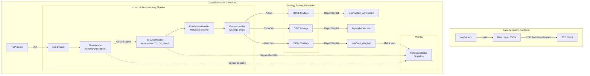

# CENG302 Dönem Sonu Ödevi - Data Middleware Uygulama Planı

Bu proje, bir borsa kuruluşu için saniyede binlerce işlem (log) üreten bir **Veri Üretici (Data Generator)** ile bu verileri filtreleyen, anonimleştiren, zenginleştiren ve farklı formatlarda çıktı veren bir **Ara Katman (Middleware)** servisinin Dockerize edilerek geliştirilmesini kapsar.

Projede nesne yönelimli tasarım ilkelerine uygun, genişletilebilir ve yüksek performanslı bir yapı kurulacaktır.

---

## Mimarimiz ve Bileşenler

Sistem iki adet Docker konteynerinden oluşacaktır:
1. **data-generator (Veri Üretici)**: Asenkron olarak yüksek hızda borsa işlem günlükleri (loglar) üretecek ve TCP soketi üzerinden Middleware'e aktaracaktır.
2. **data-middleware (Ara Katman)**: TCP üzerinden gelen ham log akışını okuyacak, işlem hattından (pipeline) geçirecek ve çıktı formatlarına dönüştürerek diske veya konsola yazacaktır.

---

## Kullanılacak Tasarım Kalıpları (Design Patterns)

Projede en az 2 tasarım kalıbı zorunluluğunu aşarak **4 adet tasarım kalıbı** kullanacağız. Bu hem yazılım kalitesini artıracak hem de sunum/rapor için güçlü bir temel oluşturacaktır:

1. **Chain of Responsibility (Sorumluluk Zinciri - Davranışsal)**:
   - **Neden?**: Log verisi sırasıyla Filtreleme -> Maskeleme (Güvenlik) -> Zenginleştirme -> Formatlama aşamalarından geçmelidir. Her adım bir sonraki adıma veriyi iletir.
   - **Nasıl?**: `LogHandler` adında bir soyut sınıf tanımlanacak. `FilterHandler`, `SecurityHandler`, `EnrichmentHandler` ve `FormatHandler` bu sınıftan türeyecek.

2. **Strategy (Strateji - Davranışsal)**:
   - **Neden?**: System Admin (HTML), CyberSec (CSV) ve Web Dev (JSON) rolleri için farklı formatta çıktılar üretilmelidir. Formatlama algoritması çalışma zamanında seçilecektir.
   - **Nasıl?**: `FormatterStrategy` arayüzü tanımlanacak. `HtmlFormatter`, `CsvFormatter` ve `JsonFormatter` sınıfları bu arayüzü uygulayarak kendi formatlama kurallarını işletecektir.

3. **Factory Method (Fabrika Metodu - Yaratısal)**:
   - **Neden?**: Veri üreticide (Data Generator) farklı senaryolara ait (başarılı borsa işlemi, hatalı giriş denemesi, kritik sistem hatası, şüpheli transfer vb.) log nesnelerini temiz bir şekilde üretmek için.
   - **Nasıl?**: `LogFactory` sınıfı, gelen senaryo tipine göre uygun log verisi şablonunu oluşturacaktır.

4. **Singleton (Tekil - Yaratısal)**:
   - **Neden?**: Sistem performansını (saniyede işlenen log sayısı, filtrelenen log sayısı, ortalama gecikme vb.) ölçmek için tüm sistem genelinde tek bir performans sayacına (`MetricsCollector`) ihtiyaç vardır.
   - **Nasıl?**: Sadece tek bir instance'ı olabilen thread-safe `MetricsCollector` sınıfı yazılacaktır.

---

## Önerilen Teknolojik Altyapı

- **Dil**: **Python 3.11+** (Hem nesne yönelimli tasarım kalıplarını temiz göstermek hem de `asyncio` kütüphanesi sayesinde tek thread üzerinde saniyede 15.000+ işlem gücüne ulaşabilmek için en ideal dildir).
- **Protokol**: **TCP Soket (Newline-Delimited JSON)**. HTTP protokolünün getirdiği overhead (header boyutları, HTTP el sıkışması vb.) elenecek, ham soket üzerinden loglar satır satır akıtılacaktır. Bu sayede performans maksimize edilecektir.
- **Docker**: `docker-compose.yml` ile iki servis ayağa kaldırılacak:
  - `generator`: Log üreten istemci.
  - `middleware`: TCP soket sunucusu ve işlemci.

---

## Ödev Aşamaları ve Tahmini Plan

### Bileşen 1: Altyapı ve Veri Üretici (Generator)
- [ ] Docker ve proje dizin yapısının kurulması.
- [ ] `generator/` dizininde `LogFactory` yapısının kurulması (Kredi kartı, TC no, e-posta gibi verileri rastgele üreten mekanizma dahil).
- [ ] Asenkron TCP istemcisinin yazılması (Belirlenen hızda veri basabilen yapıda).

### Bileşen 2: Ara Katman (Middleware) Core Yapı
- [ ] `middleware/` dizininde asenkron TCP sunucusunun yazılması.
- [ ] `MetricsCollector` (Singleton) sınıfının oluşturulması.
- [ ] `LogHandler` (Chain of Responsibility) temel yapısının kurulması:
  - `FilterHandler` (INFO/WARNING loglarını ayıklayan filtre).
  - `SecurityHandler` (GDPR/KVKK maskeleme yapan modül).
  - `EnrichmentHandler` (Metadata ekleyen modül).
- [ ] `FormatterStrategy` (Strategy) yapısının kurulması (HTML, CSV, JSON biçimlendiriciler).
- [ ] İşlenen logların rol bazlı olarak `logs/system_admin.html`, `logs/cybersec.csv` ve `logs/web_dev.json` dosyalarına asenkron yazılması.

### Bileşen 3: Performans ve Entegrasyon
- [ ] `docker-compose.yml` dosyasının hazırlanması.
- [ ] Performans testi için yüksek hacimli log üretim testi (örn. 100.000 log gönderimi).
- [ ] Saniyedeki İşlem Sayısı (TPS - Transactions Per Second) ve gecikme metriklerinin ölçülmesi ve raporlanması.

---

## Kullanıcı İncelemesi Gereken Konular

> [!IMPORTANT]
> Projede kullanılacak programlama dili olarak **Python** seçilmiştir. Python'un `asyncio` altyapısı sayesinde ek bir veritabanı veya karmaşık kütüphane kurmadan saniyede 20.000+ transaction'ı çok rahat işleyebiliriz. Eğer okulunuzda özellikle **Java** veya **C#** gibi başka bir dil zorunluluğu varsa lütfen belirtiniz.

---

## Doğrulama Planı

### Performans Testleri
- Log üretici saniyede 1.000, 5.000 ve 10.000 log üretecek şekilde ayarlanarak test edilecek.
- Middleware tarafında `MetricsCollector` aracılığıyla anlık TPS değeri konsola basılacak ve hedeflenen "saniyede binlerce işlem" performansı doğrulanacak.

### Fonksiyonel Testler
- Maskelenmiş veriler kontrol edilecek (Örn: `1234-****-****-5678`, `321*****45`, `u***@email.com`).
- Rol çıktı dosyaları (`logs/`) incelenerek formatların doğruluğu teyit edilecek.
